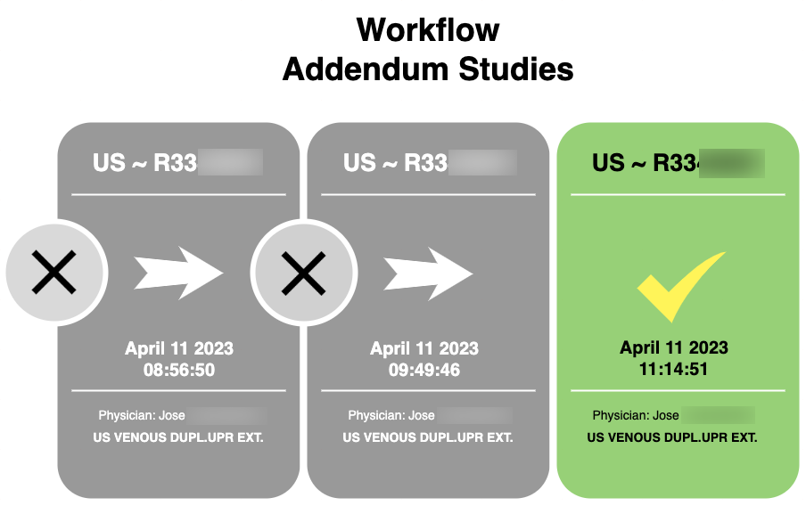
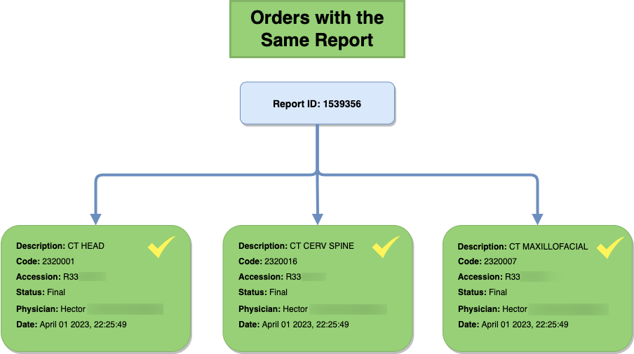
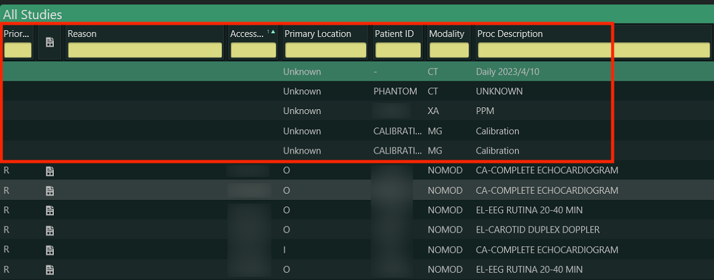

# API Gateway

API Gateway es un potente software diseñado por DISS que proporciona una conectividad perfecta a varias fuentes de datos. Permite a los usuarios acceder y administrar sin esfuerzo la información de los administradores de bases de datos, excel, pdf, imágenes y muchas otras fuentes. 

Con sus capacidades avanzadas, API Gateway agiliza el proceso de adquisición, procesamiento y entrega de datos, lo que lo convierte en una herramienta esencial para DISS Analytics. Al proporcionar una interfaz unificada para acceder a los datos, elimina la necesidad de múltiples herramientas, ahorrando tiempo y esfuerzo. En general, API Gateway es una solución valiosa que simplifica la integración de datos, agiliza los flujos de trabajo y mejora la productividad.

## Addendum

Si un reporte tiene más de una Addendum, los estudios no se duplicarán en la presentación final, pero prevalecerá el Addendum más reciente.

## Reportes con múltiples estudios 

En cuanto a los Reportes que contienen más de un estudio, todos ellos son considerados y subidos a DISS Analytics.

## Estudios de prueba y calibración

Otro tema importante a tener en cuenta es que se ignorarán los estudios de prueba y calibración, así como aquellos que no tengan un número de acceso. De esta forma, estos estudios no afectarán a la factura del médico.

##
# Requisitos:

* Acceso a Internet (Mínimo 30 MB)
* Acceso de lectura a bases de datos
* API
* Vista filtrada de la base de datos
* Configuración del Firewall
* Agregue la API de DISS Analytics a la lista blanca en Antivirus
* Acceso remoto al servidor con usuario de lectura y escritura
* Documentación del sistema
* Flujo de trabajo de procesos internos del departamento involucrado en el proyecto