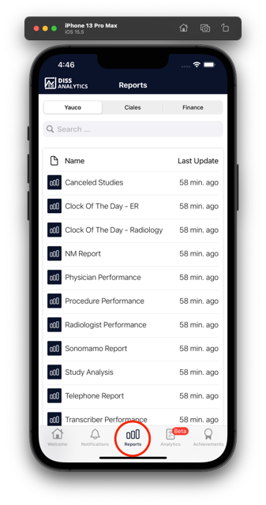
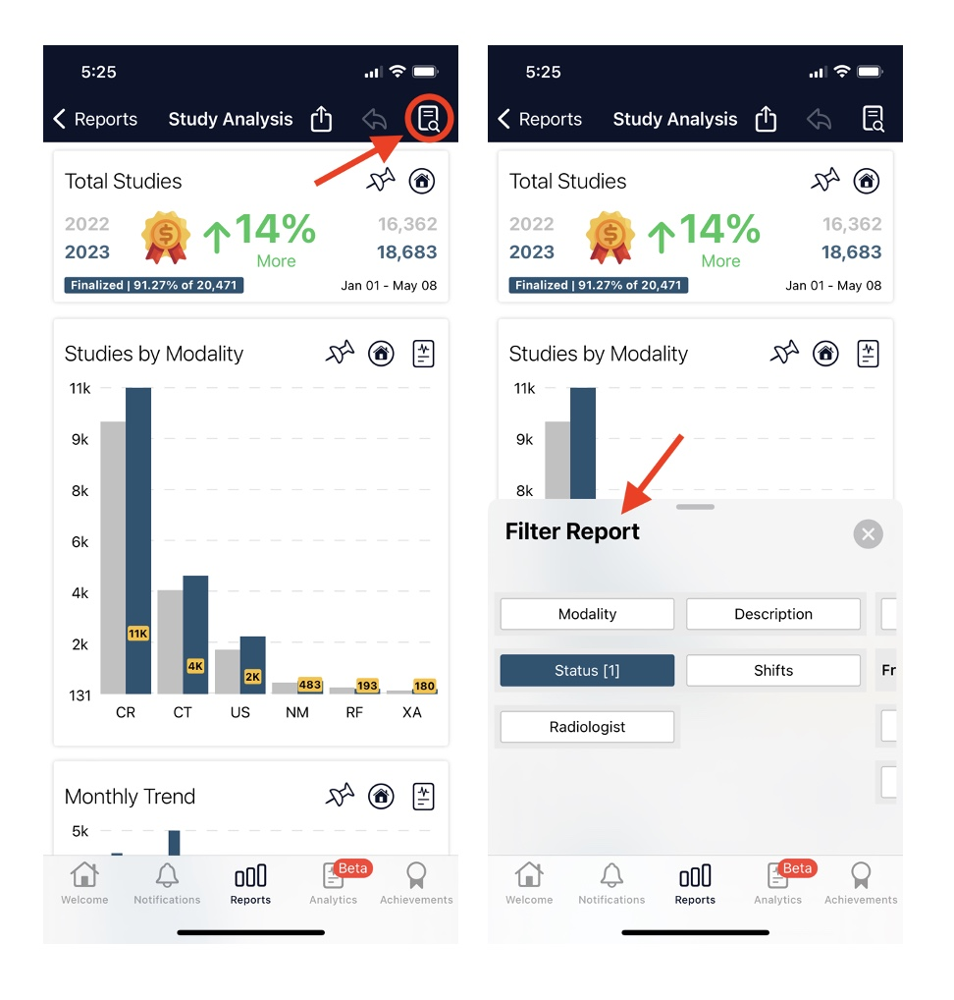

# Reports

DISS Analytics has different reports, default and custom. They can be managed and filtered by modalities, studies or active personnel, comparative information is obtained at a percentage level by days, months, quarterly or by years. All reports can be exported to word, excel or PDF.

The reports are managed with the data provided by the center, allowing you to obtain information about your data quickly and efficiently in real time. It can generate sales, financial or any other type of reports and it includes the option to focus reports on specific users or have users with full access.

To view the list of reports, please click on "reports" or remain on the "welcome" page.

## Standard

We have standard reports ready to be used and view your information in record time.

<strong>Available Reports: </strong>

- Canceled Studies
- Clock Of The Day - Radiology
- Physician Performance
- Procedure Performance
- Study Analysis
- Transcriber Performance
- Turnaround
- Physician Productivity
- Revenue

## Customization Reports

DISS Analytics personalized reports can be adapted to the needs of each health center by departments, supply needs, studies, emergencies, specialists or the different finance areas.

## Filters

The app has different types of filters, by month, by quarter, by year and dynamic filters.

To view the filters, it is necessary to click on the following icon to display them.

## To export the reports: 

Select the report you want to export.

Click the “Share” icon at the top. 

Select the format (excel or PDF).

Send it to the registered mail and confirm sending the email

## Excel Report Example

## Word Report Example

## PDF